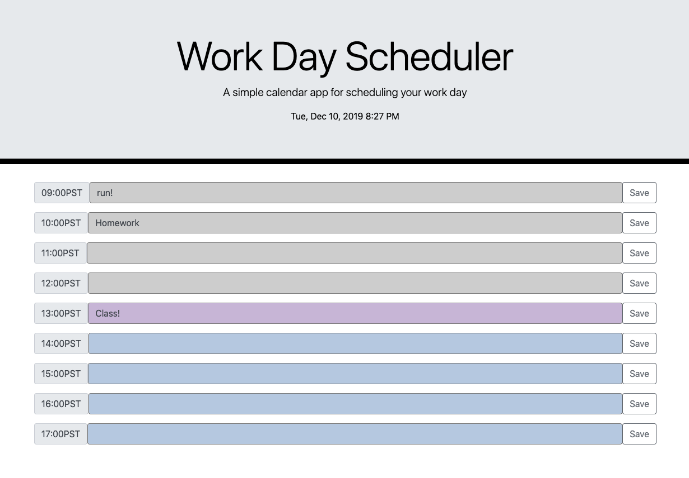

# Unit 05 Third-Party APIs - Day Planner

# Table of Contents (Optional)
N/A

# Installation
 
View website. https://alexahanthony.github.io/Day-Planner/

View Github Repository. https://github.com/alexahanthony/Day-Planner

# Usage
This website allows you to view the current day and time and add activities for the work day by hour. The user input is stored locally so that when the page is refreshed, the input value remains in the box. 
Additionally, the current time is highlighted as a different color and past time is greyed out. 

# Credits
There were no collaborators, (other than classmates and teacher feedback).

# Third-party assets: 
https://getbootstrap.com/ for styling

https://www.w3schools.com/ for help with styling

https://stackoverflow.com/ for help with syntax

# License
N/A

# Badges
N/A

# Contributing
N/A

# Tests
N/A
